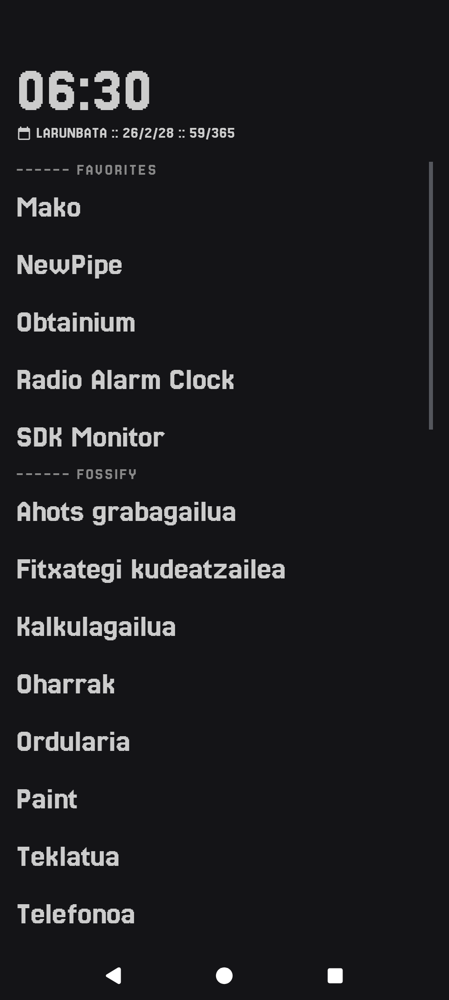
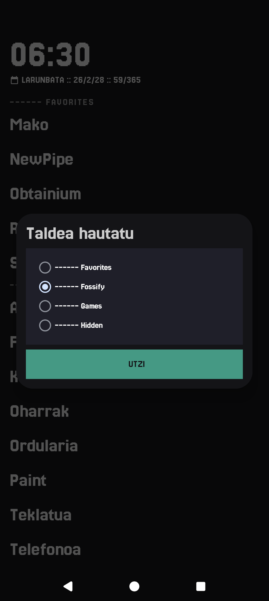
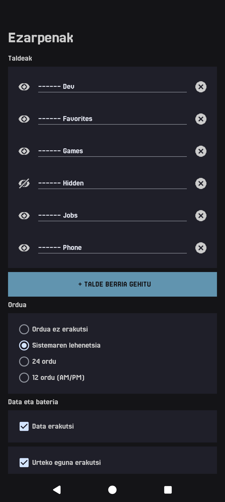

# Mako Launcher

**Mako Launcher** is a **minimal, privacy-first Android launcher** designed for focus, speed, and simplicity.

Built entirely in **native Kotlin**, Mako runs fully **on-device**, avoids tracking, and keeps distractions to a minimum by emphasizing clarity and intentional interaction.

---

## • Overview

Mako is a **distraction-free home screen replacement** focused on:

- 🧘 Minimal UI
- 🔒 Privacy-first design
- ⚡ Fast startup & low memory usage
- 📵 No ads, no analytics, no internet dependency

Everything runs locally, with **no background services** unless explicitly needed.

---

## • Screenshots

| Home | App Drawer | Settings | About |
|------|------------|----------|-------|
|  |  |  |  |

---

## • Features

- 📱 **Minimal Home Screen**
  - Clock, date, and status information
  - No widgets overload
- 🚀 **Fast App Launcher**
  - Lightweight app drawer
- 🔋 **Efficient**
  - Low memory usage
  - No unnecessary background work

---

## • Permissions

Mako Launcher requires **only essential permissions**:

- **Set as Home App** – to function as a launcher
- **Query Installed Apps** – to list and launch applications

No network access is required.

---

## • Installation

### From Releases
Download the latest APK from the  
👉 **[Releases page](https://github.com/jmiguelrivas/mako/releases)**

---

## • Philosophy

Mako follows a few core principles:

* **Offline-first**
* **No telemetry**
* **No dark patterns**

---

## • License

**Mako Launcher** is Free Software.
You are free to use, study, share, and improve it under the terms of the
**GNU General Public License v3** or later.

---

## • Acknowledgements

Inspired by minimal launchers and privacy-focused Android tooling.

Built with ❤️ and restraint.